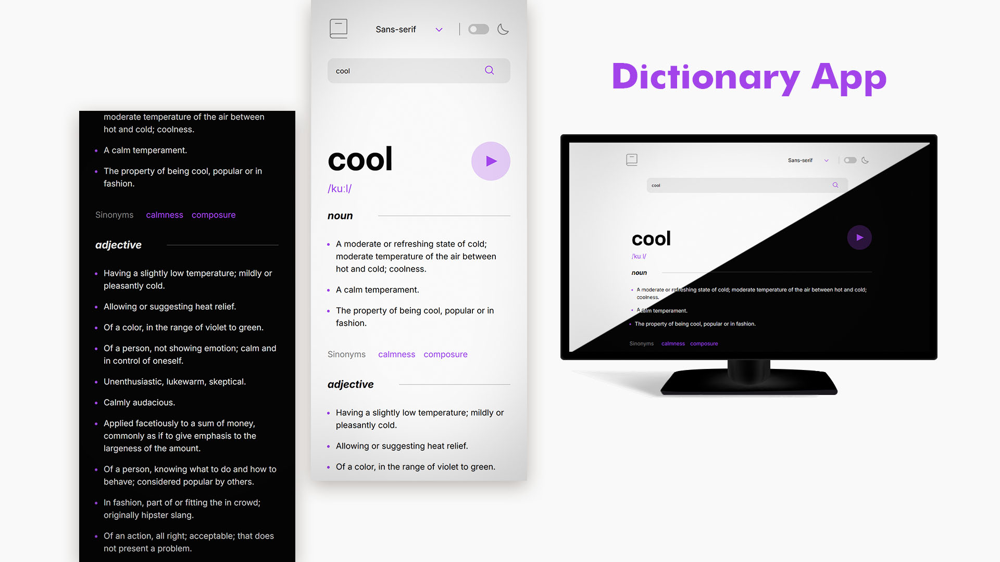

# Dictionary App

I suppose there's not much to explain. It's just a dictionary... built using `react-query-dom` and `react` (of course)!

<a href="https://malconh.github.io/dictionary-app" target="_blank" rel="noopener noreferrer">
  
</a>

## Features

- Search field to look up words.
- A play button (_some words may not have it_) to listen **how** to pronounce it.
- Light/dark mode
- Option the change the body font to suit your reading preferences! Sans-serif, serif and mono

## How it looks



<a href="https://malconh.github.io/dictionary-app" target="_blank" rel="noopener noreferrer">
  
</a>

## Installation

### Pre-requisites

Please install Node to run `npm` commands.
For this README I'm using `pnpm` but you can use either with no trouble.

### Use project

1. Clone this project or download it

```bash
git clone https://github.com/malconh/dictionary-app.git
cd dictionary app
```

2. Install dependencies

```bash
pnpm install
```

3. Run the development environment

```bash
pnpm run dev
```

4. You can also built the distributable files if you want.

```bash
pnpm run build
```

It will create a `distr` file in the project's root.

## My links

<a href="https://www.linkedin.com/in/malcon-heltner/" target="_blank" rel="noopener noreferrer">

</a>
<a href="https://www.github.com/malconh" target="_blank" rel="noopener noreferrer">

</a>
